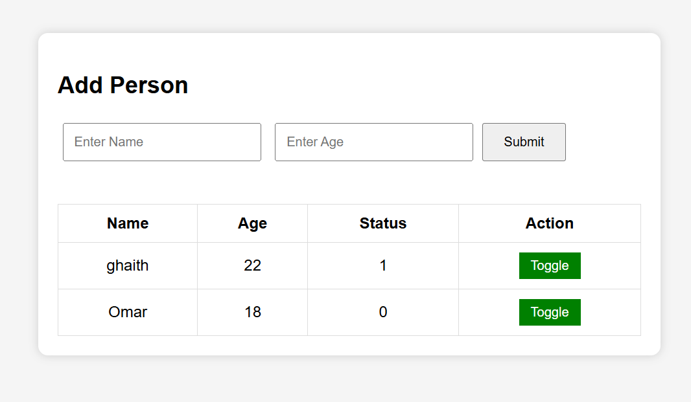

# People Management System

A simple web application built with HTML, CSS, JavaScript, PHP, and MySQL. The system allows users to add people, store their information in a MySQL database, display records in a table, and toggle each person's status without refreshing the page using AJAX.

## Features

- Add a person's name and age.
- Store data in a MySQL database.
- Display all records in a table.
- Toggle the status (0/1) without reloading the page.
- Update the table dynamically using JavaScript and Fetch API.

## Technologies Used

- HTML5
- CSS3
- JavaScript
- PHP
- MySQL
- Fetch API (AJAX)

## Project Structure

```
People-Management-System/
│── Form.php
│── db1.php
│── insert.php
│── fetch.php
│── toggle.php
│── script.js
│── S.css
│── Screenshot.png
└── README.md
```

## Database

Create a MySQL database and create the following table:

```sql
CREATE TABLE people (
    id INT AUTO_INCREMENT PRIMARY KEY,
    name VARCHAR(100) NOT NULL,
    age INT NOT NULL,
    status TINYINT(1) DEFAULT 0
);
```

## How to Run

1. Create a MySQL database.
2. Create the `people` table.
3. Update the database credentials in `db1.php`.
4. Upload the project files to your web server (e.g., InfinityFree).
5. Open `Form.php` in your browser.

## Website

[https://ghaith.free.je/](https://ghaith.free.je/Form.php)

## Screenshot



## Author

**Ghaith**
